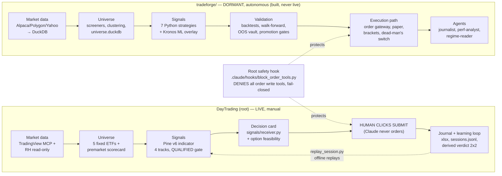
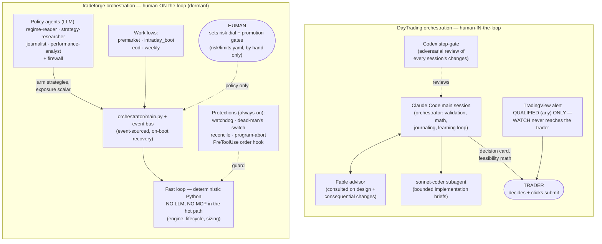
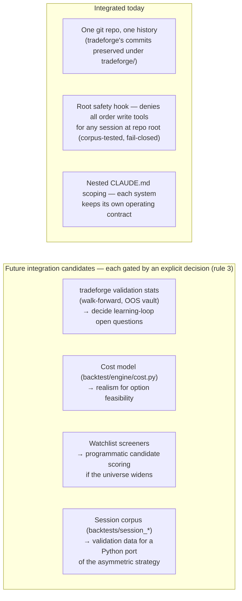

# Feature Map — DayTrading (root) vs tradeforge/

Functional comparison of the two systems in this repo, by trading-pipeline stage.
DayTrading is the **live, manual decision-support cockpit** for the single
asymmetric options campaign (strategy.md is authoritative). tradeforge/ is a
**dormant autonomous trading platform** kept for later integration — it is NOT
an active strategy source (CLAUDE.md hard rule 3).

**The philosophical split:** DayTrading assumes the *human* is the edge and the
system enforces discipline — its learning loop grades the trader
(CORRECT_NO_TRADE / MISSED_SIGNAL / ...). tradeforge assumes the *code* is the
edge and the human sets policy — its validation stack grades strategies
(PF, OOS, walk-forward). Complementary, not redundant: tradeforge has zero
Pine Script; DayTrading has zero broker-facing code.

## Pipeline overview

## Stage-by-stage comparison

| Stage | DayTrading (root — live, in use) | tradeforge/ (dormant) |
|---|---|---|
| **Market data** | TradingView MCP (live charts) + Robinhood read-only; 5m bars saved per session to `backtests/session_*/` | Alpaca/Polygon/Yahoo ingest pipelines → DuckDB (97 MB), corporate actions, point-in-time levels, nightly refresh script |
| **Universe selection** | Fixed 5 ETFs (SPY/QQQ/XLE/XLF/IWM); premarket scorecard (`analysis/premarket_scorecard.py`, strategy.md §9) | Full watchlist engine: weekly screener runs, stock/crypto/unusual-volume screeners, clustering, level-respect scoring, universe DB |
| **Signal generation** | Pine v6 indicator — four tracks (PDH/PDL/ORH/ORL), WATCH→QUALIFIED/REJECT/EXPIRED state machine; `signals/receiver.py` turns alerts into decision cards | 7 Python strategies (breakout_retest, level_meanrev, momentum_thrust, momentum_rotation, swing_breakout, swing_meanrev, lev_trend) with a RESEARCH→BACKTEST→PAPER→LIVE lifecycle in `registry.yaml`; Kronos ML forecast overlay |
| **Validation / backtest** | Pine backtest strategy + `analysis/replay_session.py` (exact offline replay of the live engine); evals harness (decision-quality, safety, regression) | Intraday + daily-bracket + NAV portfolio backtesters, cost model, walk-forward, locked OOS vault, multiple-testing correction, promotion gates (`run_gate.py`), hypothesis logs |
| **Options** | Full stdlib toolkit: Black-Scholes engine (`analysis/option_pricing.py`), structure lab with §8 exit-precedence path walking, $25-cap contract feasibility check | **None.** Options were probed (`research/spy_qqq_call_overlay_RtoR_probe.md`) and rejected; equities-only by design |
| **Risk & sizing** | Fixed: 1R = $25, 1 contract, 1 trade/day; R rises only after 5 correctly executed trades | Risk-index dial (`risk/limits.yaml`): per-trade % of equity, conviction tiers B/A/A+, heat caps, milestone ratchet, program-abort thresholds, circuit breakers |
| **Execution** | **None, by design.** The trader clicks submit; the root hook denies every order tool | Full autonomous path, built but never live: order gateway, simulated brackets, paper-trading engine, order-book state machine, broker-vs-ledger reconciliation, dead-man's switch, watchdog |
| **Journaling / learning** | Trading_Journal.xlsx (manual, R-based), `backtests/sessions.jsonl` with the derived 2×2 verdict, weekly learning report — measures **trader rule adherence** | journalist + performance-analyst agents (auto journals, equity curve, alpha-vs-SPY, edge-decay detection), prop-firm evaluation engine — measures **the system's edge** |
| **Orchestration** | Claude as decision-support orchestrator + sonnet-coder; TradingView alerts interrupt only on QUALIFIED | 4-agent roster (regime-reader, strategy-researcher, journalist, performance-analyst) + premarket/intraday/EOD/weekly workflows + launchd cron templates (not loaded) |

## Orchestrator & agents perspective

The deepest difference between the two systems is *who is in the loop and when*.
DayTrading is **human-in-the-loop at the decision point**: agents prepare and
verify, one alert channel interrupts, the trader decides. tradeforge is
**human-on-the-loop at the policy level**: LLM agents set the board daily,
deterministic code executes and protects, the human only moves the risk dial
and promotion gates.

| Orchestration aspect | DayTrading (root) | tradeforge/ |
|---|---|---|
| **Orchestrator** | Claude Code main session — interactive, per-session | `orchestrator/main.py` + event bus — long-running runtime, event-sourced with on-boot orphan-order recovery |
| **Where the LLM sits** | In the loop for validation/math/journaling; **never** on the submit click | Policy layer only: agents arm strategies and set exposure; **no LLM or MCP call in the hot path** |
| **Agent roster** | `sonnet-coder` (implementation), Fable advisor (design consults), Codex stop-gate (adversarial review) | `regime-reader` (daily regime tag → arms strategies), `strategy-researcher` (offline mining, writes nothing live), `journalist` (per-trade journals + digests), `performance-analyst` (equity curve, decay, ratchet, risk-of-ruin), `firewall` |
| **Interrupt model** | One channel: TradingView "QUALIFIED (any)" alert. WATCH is deliberately kept off the trader's screen (2026-07-13 lesson) | Event bus: bar events, order lifecycle events, agent verdicts; workflows fire on schedule (premarket/intraday-boot/EOD/weekly) |
| **Scheduling** | Manual daily workflow (07:45 premarket → 08:45–10:30 window → 14:55 flat → post-close record) | launchd cron templates (`scripts/cron/`): nightly data refresh + watchdog — **not installed** |
| **Safety enforcement** | Root PreToolUse hook denies ALL order tools, fail-closed; receiver is brokerage-free by construction; rules 1–5 in CLAUDE.md | Gated PreToolUse hook (delegates to `orchestrator/hooks.py` evaluator), watchdog, dead-man's switch, broker-vs-ledger reconcile halt, program-abort thresholds |
| **Human's job** | Make the trade decision; execute manually; get graded by the learning loop | Set the risk dial and promotion gates by hand; review at milestones; never tune live knobs from live P&L |
| **Agent config lives in** | `.claude/settings.json`, `.claude/agents/sonnet-coder.md` (root) | `tradeforge/.claude/agents/*.md` (4 agents) + `.codex/` mirror (TOML), `orchestrator/agents/*.py` runtime implementations |

## What is integrated today

1. **One git repo, one history.** tradeforge's 18 commits preserved via `git mv` (no rewrite); everything lives under `tradeforge/`.
2. **Root safety hook.** The only *functional* cross-cutting piece: `.claude/hooks/block_order_tools.py` + the PreToolUse matcher deny every order write tool (place/cancel/review/modify/…, suffixed forms, both verb orders), fail-closed if the hook itself breaks. Corpus test: `.claude/hooks/test_block_order_tools.py`.
3. **Nothing else.** No shared data, code paths, or risk config. Nothing in `signals/` or `analysis/` imports tradeforge.

## What needs updating

Priority order, to keep tradeforge honest as a dormant asset:

1. **`risk_index 6→4` vs its tests.** The committed dial change contradicts the RI-6-floor assertions — 11 of 583 tests fail (`test_conviction`, portfolio engine/intents). Decide: revert the dial or update the tests. Until then tradeforge has no green baseline.
2. **Stale data.** `market.duckdb` is from Jun 29; the nightly-refresh launchd job is a template, not installed. Fine while dormant; any backtest there runs on month-old data.
3. **Placeholder MCP configs.** `tradeforge/.mcp.json` and `.codex/config.toml` still contain `REPLACE_WITH_..._MCP_COMMAND` for tradingview/robinhood.
4. **Contract awareness.** A session opened *inside* `tradeforge/` runs under its CLAUDE.md (autonomous-platform rules), not DayTrading's. Structural scoping handles it, but be conscious of where a session is rooted.

## Future integration candidates

Each is a deliberate, explicit decision — mapped here, not recommended (CLAUDE.md rule 3):

- **Validation machinery → your strategy.** The learning loop's open questions (pre-window REJECT re-arm, RVOL measured on the confirmation bar) will eventually need walk-forward/OOS discipline; `tradeforge/backtest/stats/` already has it.
- **Cost model.** `tradeforge/backtest/engine/cost.py` models real friction; the option feasibility check could borrow its realism once the sample grows.
- **Screeners → candidate scoring.** The premarket scorecard ranks 5 fixed ETFs; tradeforge's level-respect and volume screeners do that job programmatically if the universe ever widens.
- **Session corpus as shared fuel.** `backtests/session_*/` dirs are exactly the point-in-time data tradeforge's backtesters consume — the accumulating ~20-session corpus could double as the validation set for a Python port of the asymmetric strategy (which would also close learning-loop open item #3: proving the Python engine stays faithful to the Pine).
